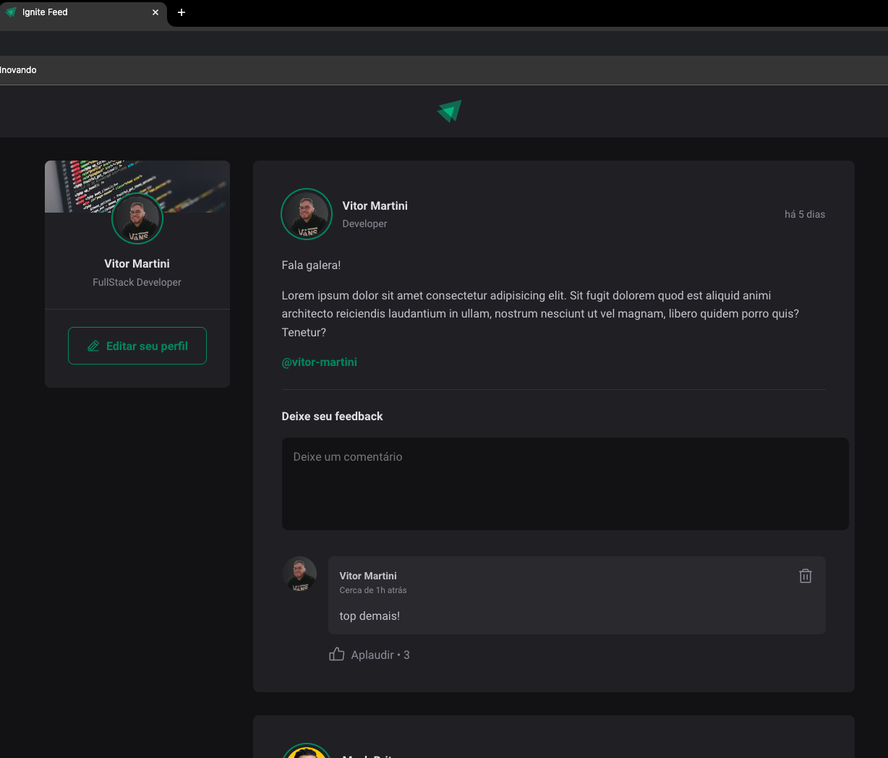

# Ignite Feed Application 
This project is a **Feed application**  developed using **React** , **TypeScript** , and **Vite** . The project is part of the **Rocketseat Ignite course** , where I followed along with the instructions and coded it while watching the lessons. The goal was to solidify my understanding of modern web development practices and improve my TypeScript skills.
## Features 

- Display posts with author information and published date.

- Posts contain content such as text paragraphs and links.

## Tech Stack 
 
- **React** : For building the user interface.
 
- **TypeScript** : To ensure type safety and better code maintenance.
 
- **Vite** : A fast and efficient build tool for modern web applications.
 
- **Date-fns** : To handle date formatting and manipulation.

## Live Demo
You can see the live version of this project [here](https://vitor-martini.github.io/ignite-feed).

## Print Screen
